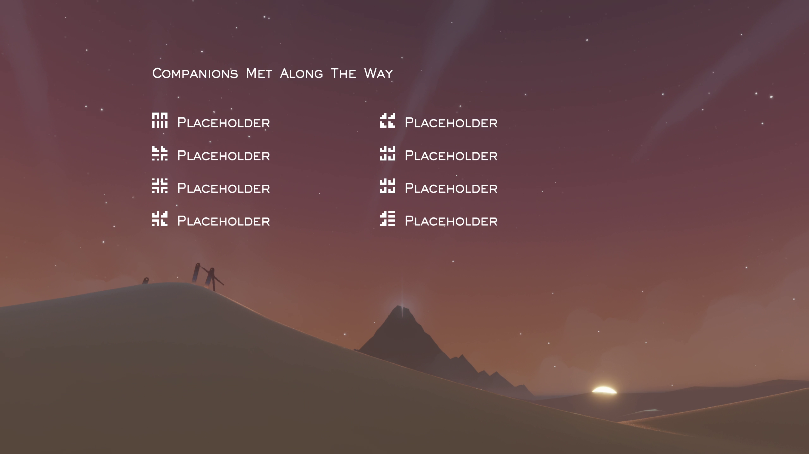
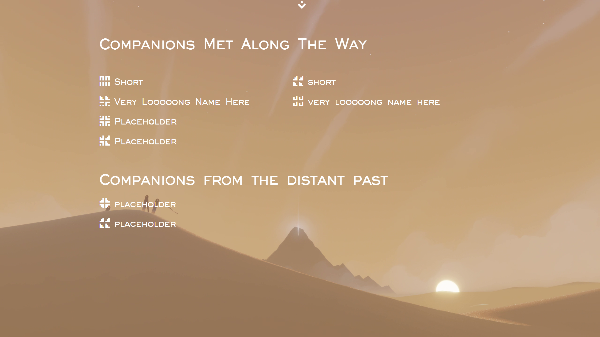

# Journey Save Parser

## Official Links
<ul>
	<li><a href="https://journey.coldknife2.ninja/">Parser</a></li>
	<li><a href="https://journey.coldknife2.ninja/stats/">Statistics</a></li>
	<li><a href="https://journey.coldknife2.ninja/editor/">Editor</a></li>
	<li><a href="https://journey.coldknife2.ninja/about/">About</a></li>
</ul>

## Parser

[Journey](https://thatgamecompany.com/journey/) is a video game made by [ThatGameCompany](https://thatgamecompany.com/).

This game does not contain any conventional communication means, instead players have to rely on their movement and [chirps](https://journey.fandom.com/wiki/Chirp) alone. 

At the end of a playthrough the game reveals the companions a player has been traveling with in form of the CMATW (Companions Met Along The Way) screen.

This project emulates said CMATW screen to give players the ability to look up their companions mid-Journey in order to enable greater cooperation.
This works by extracting the necessary values from the save file of the game (SAVE.BIN) and parsing it. An explanation of the SAVE.BIN file can be found [here](https://journey.fandom.com/wiki/Guide:_PC_version_-_Companions_Met_Along_the_Way_Problems#Steam_-_SAVE.BIN).

The parser also differentiates between past and current Journeys and groups companions accordingly.

## Editor and Statistics

The project also contains an editor, that allows players to edit certain values in their save file for greater freedom when playing. Players are asked to show consideration towards fellow companions and should not abuse the editor or attempt to ruin the game for others.
The editor has drawn inspiration as well as offsets from [this](https://github.com/zackmichaels5/Journey-Save-Editor) project.

The Statistics page displays all currently known information that can be extracted from a given SAVE.BIN (Companion data is not included, as it is already shown in the Parser).

## Development

This project uses [unplugin-vue-components](https://www.npmjs.com/package/unplugin-vue-components) for imports. As such, you should never import any `.vue` file directly. Before committing make sure to execute `npm run build`, as the [components.d.ts](/components.d.ts) file does not update on its own.