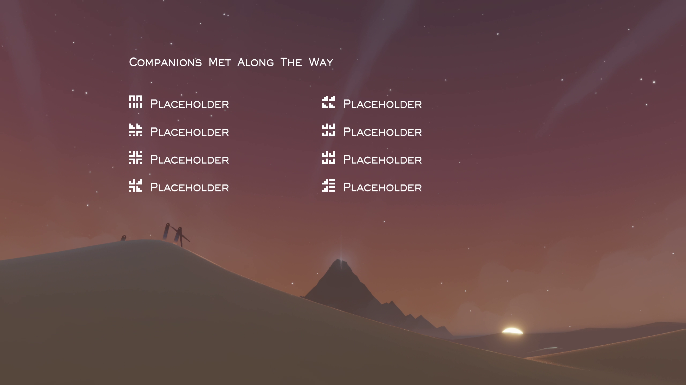
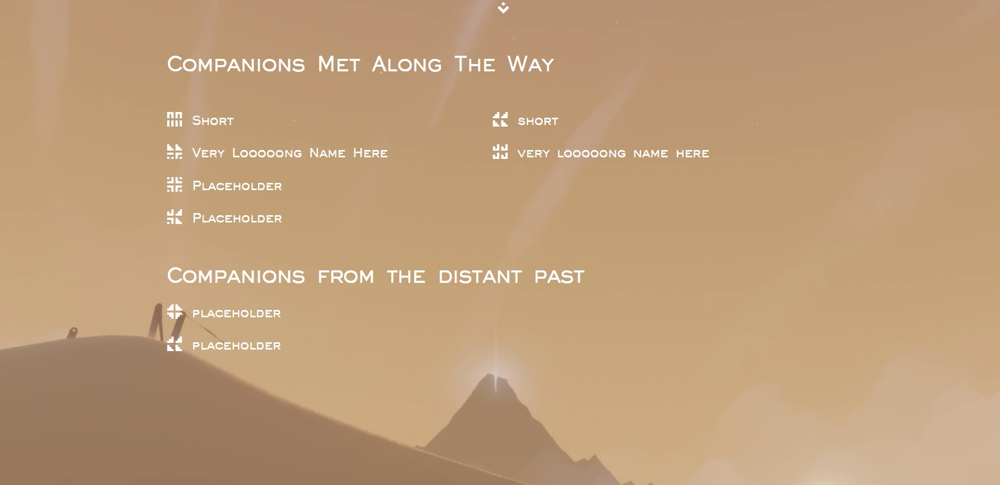

# Journey Parser

The official website can be found [here](https://www.coldknife2.ninja/Journey/journeyParser.html).

___
## CMATW
[Journey](https://thatgamecompany.com/journey/) is a video game made by [ThatGameCompany](https://thatgamecompany.com/).

In this game, during your adventure, you are matched with players from around the world without knowing who they are.

You cannot communicate with speech or text as there is only what is called a [Chirp](https://journey.fandom.com/wiki/Chirp), but the adventure is a shared experience and you can often grow fond of your partner.

At the end of the game, a screen appears that reveals the names of the people you've met during your adventure. This screen is called "Companions Met Along The Way" or CMATW for short.

This project aims to give players the abilty to display the names of companions they've met, in a manner similar to what the game does. It currently works with the [Steam](https://store.steampowered.com/app/638230/Journey) version only.

This is an example for how the project looks:

To understand what the "SAVE.BIN" the website is talking about is, please take a look at [The Journey Wiki](https://journey.fandom.com/wiki/Guide:_PC_version_-_Companions_Met_Along_the_Way_Problems).

___
## Save editor

Recently a new functionality was added that had been around in the Journey community for a while in the form of an Executable.

But now it is also available [online](https://www.coldknife2.ninja/Journey/journeyEditor.html)!

With this editor, players will be able to choose multiple parameters concerning their Journey saves, such as scarf length, symbol used, robe color and selected level.